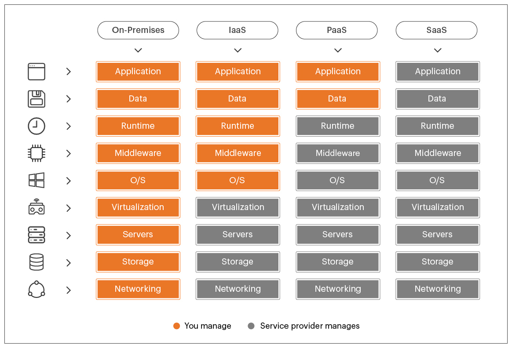

# AWS Cloud Practitioner Foundational 2023

Este repositório foi criado com o intuito de realizar minhas anotações durante meus estudos para a certificação <a href="https://aws.amazon.com/pt/certification/certified-cloud-practitioner/">AWS Certified Cloud Practitioner</a> e compartilhá-las com quem precise.

* [Tópicos](#topicos)
    - [Pesos](#Pesos)
    - [Conceitos de nuvem](#nuvem)
    - [Segurança e conformidade](#seguranca)

## Pesos
Domínio | % do exame
---------|----------|
Domínio 1: Conceitos de nuvem | 26%  
Domínio 2: Segurança e conformidade | 25%  
Domínio 3: Technology | 33%  
Domínio 4: Billing and pricing | 16%  
TOTAL | 100%

**[REFERÊNCIA](https://d1.awsstatic.com/pt_BR/training-and-certification/docs-cloud-practitioner/AWS-Certified-Cloud-Practitioner_Exam-Guide.pdf)** 

## Conceitos de nuvem

### 1. O que é Cloud Computing?
Define-se na utilização de recurso de TI sob demanda por meio da internet e sua cobrança é realizada de acordo com o uso.

**[REFERÊNCIA](https://aws.amazon.com/pt/what-is-cloud-computing/)**

### 2. Vantagens em se utilizar Cloud Computing
* **Agilidade:** maior agilidade no processo de desenvolvimento e implatanção de soluções.
* **Elasticidade:** permite provisionar mais recurso às soluções de acordo com a demanda, aumentando e diminuindo seus recursos de forma automática, sem interrupção do serviço.
* **Economia de custo:** o custo é mais baixo devido a cobrança ser realizada de acordo com a utilização dos recursos, além de possibilitar a contratação de planos de economia, diminuindo ainda mais seu preço.
* **Implantação global em questão de minutos:** a nuvem possibilita ampliar seus atividades em várias regiões geográficas e implantação em minutos.

**[REFERÊNCIA](https://docs.aws.amazon.com/pt_br/whitepapers/latest/aws-overview/six-advantages-of-cloud-computing.html)**

### 3. Tipos de Cloud Computing
* **IaaS (Infrastructure as a Service):** oferece o mais alto nível de flexibilidade e controle de gerenciamento sobre recursos, contendo os componente básicos de TI em nuvem. Exemplo AWS EC2.
* **PaaS (Plataform as a Service):** não é necessário o gerenciamento de infraestutura (hardware e sistemas operacionais), focando na implantação e gerenciamento das aplicações. Exemplo AWS Lambda.
* **SaaS (Software as a Service):** oferece um produto completo, executado e gerenciado pelo provedor de serviços. Refere-se às aplicações de usuário final. Exemplo Amazon RDS.

  

**[REFERÊNCIA](https://aws.amazon.com/pt/types-of-cloud-computing/)**

### 4. Modelos de Cloud Computing
* **Public:** modelo mais comum e utilizado, nesse tipo de contrato, o provedor tem servidores próprios onde aloca dados, softwares e sistemas de seus clientes de forma independente e isolada.
* **Private:** bem parecida com o modelo público, com a diferença que a infraestrutura contratada não é compartilhada com outros clientes.
* **Hybrid:** permite a mesclagem da praticidade da nuvem pública com a personalização e contenção da nuvem privada.

## Segurança e conformidade

### 1. Modelo de responsabilidade
Constitue em uma responsabilidade compartilhada entre a AWS e o cliente. A AWS opera, gerencia e controla os componentes do sistema operacional do host e a camada de virtualização, até a segurança física das instalações em que o serviço opera. O cliente assume a gestão e a responsabilidade pelo sistema operacional convidado (inclusive atualizações e patches de segurança), por outros softwares de aplicativos associados e pela configuração do firewall do grupo de segurança fornecido pela AWS.
* **Responsabilidade da AWS:** segurança da nuvem: a AWS é responsável por proteger a infraestrutura que executa todos os serviços oferecidos na sua nuvem.
* **Responsabilidade do cliente:** segurança na nuvem: a responsabilidade do cliente será determinada pelos Serviços de nuvem AWS selecionados por ele.

  

**[REFERÊNCIA](https://aws.amazon.com/pt/compliance/shared-responsibility-model/)**