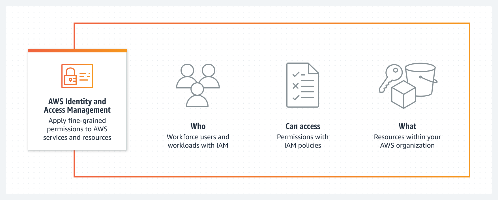

# AWS Cloud Practitioner Foundational 2023

Este repositório foi criado com o intuito de realizar minhas anotações durante meus estudos para a certificação <a href="https://aws.amazon.com/pt/certification/certified-cloud-practitioner/">AWS Certified Cloud Practitioner</a> e compartilhá-las com quem precise.

* [Tópicos](#topicos)
    - [Pesos](#Pesos)
    - [Conceitos de nuvem](#nuvem)
    - [Segurança e conformidade](#seguranca)
    - [Tecnologia](#tecnologia)
    - [Faturamento e preços](#faturamento)

## Pesos
Domínio | % do exame
---------|----------|
Domínio 1: Conceitos de nuvem | 26%  
Domínio 2: Segurança e conformidade | 25%  
Domínio 3: Tecnologia | 33%  
Domínio 4: Faturamento e preços  | 16%  
TOTAL | 100%

**[REFERÊNCIA](https://d1.awsstatic.com/pt_BR/training-and-certification/docs-cloud-practitioner/AWS-Certified-Cloud-Practitioner_Exam-Guide.pdf)** 

## Conceitos de nuvem

### 1. O que é Cloud Computing?
Define-se na utilização de recurso de TI sob demanda por meio da internet, permitindo escabilidade, e sua cobrança é realizada de acordo com o uso.

**[REFERÊNCIA](https://aws.amazon.com/pt/what-is-cloud-computing/)**

### 2. Vantagens em se utilizar Cloud Computing
* **Agilidade:** maior agilidade no processo de desenvolvimento e implatanção de soluções.
* **Elasticidade:** permite provisionar mais recurso às soluções de acordo com a demanda, aumentando e diminuindo seus recursos de forma automática, sem interrupção do serviço.
* **Economia de custo:** o custo é mais baixo devido a cobrança ser realizada de acordo com a utilização dos recursos, além de possibilitar a contratação de planos de economia, diminuindo ainda mais seu preço.
* **Implantação global em questão de minutos:** a nuvem possibilita ampliar seus atividades em várias regiões geográficas e implantação em minutos.

**[REFERÊNCIA](https://docs.aws.amazon.com/pt_br/whitepapers/latest/aws-overview/six-advantages-of-cloud-computing.html)**

### 3. Tipos de Cloud Computing
* **IaaS (Infrastructure as a Service):** oferece o mais alto nível de flexibilidade e controle de gerenciamento sobre recursos, contendo os componente básicos de TI em nuvem. Exemplo AWS EC2.
* **PaaS (Plataform as a Service):** não é necessário o gerenciamento de infraestutura (hardware e sistemas operacionais), focando na implantação e gerenciamento das aplicações. Exemplo AWS Lambda.
* **SaaS (Software as a Service):** oferece um produto completo, executado e gerenciado pelo provedor de serviços. Refere-se às aplicações de usuário final. Exemplo Amazon RDS.

  

**[REFERÊNCIA](https://aws.amazon.com/pt/types-of-cloud-computing/)**

### 4. Modelos de Cloud Computing
* **Public:** modelo mais comum e utilizado, nesse tipo de contrato, o provedor tem servidores próprios onde aloca dados, softwares e sistemas de seus clientes de forma independente e isolada.
* **Private:** bem parecida com o modelo público, com a diferença que a infraestrutura contratada não é compartilhada com outros clientes.
* **Hybrid:** permite a mesclagem da praticidade da nuvem pública com a personalização e contenção da nuvem privada.

## Segurança e conformidade

### 1. Modelo de responsabilidade
Constitue em uma responsabilidade compartilhada entre a AWS e o cliente. A AWS opera, gerencia e controla os componentes do sistema operacional do host e a camada de virtualização, até a segurança física das instalações em que o serviço opera. O cliente assume a gestão e a responsabilidade pelo sistema operacional convidado (inclusive atualizações e patches de segurança), por outros softwares de aplicativos associados e pela configuração do firewall do grupo de segurança fornecido pela AWS.
* **Responsabilidade da AWS:** segurança da nuvem: a AWS é responsável por proteger a infraestrutura que executa todos os serviços oferecidos na sua nuvem.
* **Responsabilidade do cliente:** segurança na nuvem: a responsabilidade do cliente será determinada pelos Serviços de nuvem AWS selecionados por ele.

  

**[REFERÊNCIA](https://aws.amazon.com/pt/compliance/shared-responsibility-model/)**

### 2. IAM
Com o Identity and Access Management (IAM) é possível especificar quem ou o que pode acessar serviços e recursos na AWS, gerenciar permissões de maneira centralizada e analisar o acesso para conceder as permissões na AWS.

  

### 2.1 Usuários, grupos, funções e políticas
* **Usuários:** qualquer credencial, ou identidade do IAM, que possua acessar a AWS via console, CLI ou API. Após criado, o usuário somente tem permissão de fazer login na plataforma devido o princípio do menor privilégio (least privilege principle) e recomenda-se sempre utiliza-lo. Por questões de segunrança, não é recomendado a utilização do usuário root da conta.
* **Grupos:** coleção de usuários do IAM. Facilitam o gerenciamento de permissões para grandes conjuntos de usuários.
* **Funções:** identidade do IAM que permite que uma conta tenha permissões específicas, podendo ser aplicadas a serviços da AWS.
* **Políticas:** regras que concedem ou bloqueiam acesso de usuários ou grupos aos serviços da AWS.

### 2.2 MFA
Recomenda-se a configuração da autenticação multifator (MFA) para ajudar a proteger os recursos da AWS. É pssível habilitar a MFA para o Usuário raiz da conta da AWS ou para usuários do IAM.

### 2.3 Política de senha no IAM
Recomenda-se definir uma política de senha personalizada às contas da AWS para especificar requisitos de complexidade e períodos de alternância obrigatórios para as senhas de usuários do IAM.

**[REFERÊNCIA](https://docs.aws.amazon.com/pt_br/IAM/latest/UserGuide/introduction.html/)**

## Tecnologia

### 1. AWS CLI e CloudShell
* **AWS CLI:** ferramenta unificada para o gerenciamento de seus produtos da AWS, instalada localmente nas estações de trabalho.
* **CloudShell:** shell pré-autenticado baseado em navegador onde é possível iniciar diretamente do AWS Management Console.

**[REFERÊNCIA](https://docs.aws.amazon.com/pt_br/cloud9/latest/user-guide/sample-aws-cli.html)**

### 2. Infraestrutura global da AWS
A Nuvem AWS abrange 99 zonas de disponibilidade em 31 regiões geográficas por todo o mundo, com planos já divulgados para mais 15 zonas de disponibilidade e outras 5 regiões da AWS no Canadá, Israel, Malásia, Nova Zelândia e Tailândia. 

  

### 2.1. Regiões da AWS
Local físico em todo o mundo onde datacenters são agrupados. Cada grupo de datacenters lógicos é chamado de zona de disponibilidade. Cada região da AWS consiste no mínimo em três AZs isoladas e separadas fisicamente em uma área geográfica.

### 2.2. Zonas de disponibilidade (AZ)
Consistem em um ou mais datacenters distintos com energia, rede e conectividade redundantes em uma região da AWS. As AZs proporcionam aos clientes a capacidade de operar suas aplicações com alta disponibilidade, tolerância a falhas e escalabilidade em níveis superiores aos que um único datacenter pode oferecer. As AZs são fisicamente separadas por uma distância significativa (vários quilômetros) das outras AZs, embora todas estejam em um raio de até 100 km entre si.

### 2.3. Zonas locais
Aproximam a computação, o armazenamento, o banco de dados e outros produtos da AWS selecionados dos usuários finais. Com isso é possível executar facilmente aplicativos altamente exigentes que exigem latências em milissegundos para seus usuários finais, como criação de conteúdo de mídia e entretenimento, jogos em tempo real, simulações de reservatórios, automação de projetos eletrônicos e machine learning.

### 2.4. AWS Wavelength
Implantações de infraestrutura da AWS que incorporam serviços de computação e armazenamento da AWS aos datacenters dos provedores de telecomunicações na borda das redes 5G e acessam facilmente a variedade de serviços da AWS na região.

**[REFERÊNCIA](https://aws.amazon.com/pt/about-aws/global-infrastructure/)**

### 2.5. AWS Outspots
Solução totalmente gerenciadas que fornece infraestrutura e serviços da AWS para praticamente qualquer local da borda ou on-premises para uma experiência híbrida verdadeiramente consistente. As soluções do Outposts permitem que os clientes estendam e executem serviços da AWS nativos on-premises.

**[REFERÊNCIA](https://aws.amazon.com/pt/outposts/)**

### 3. Plano de suporte

* **Basic:** plano Básico é gratuito e oferece suporte para dúvidas sobre contas e faturamento e aumentos de cotas de serviços.
* **Developer:** plano Desenvolvedor concede orientação sobre as melhores práticas, ferramentas de diagnóstico, suporte de arquitetura básica e número ilimitado de casos de suporte.
* **Business:** plano Business concede orientação de casos de uso, AWS Trusted Advisor, suporte a software de terceiros e número ilimitado de usuários do AWS Identity and Access Management (IAM).
* **Enterprise:** plano Enterprise concede orientação sobre arquitetura de aplicação, gerenciamento de eventos de infraestrutura, gerente de conta técnico, roteamento de casos "white-glove" e análises empresariais de gerenciamento.

**[REFERÊNCIA](https://docs.aws.amazon.com/pt_br/awssupport/latest/user/aws-support-plans.html)**

### 4. EC2 (Elastic Compute Cloud)

Oferece uma capacidade de computação escalável na Nuvem da Amazon Web Services. Elimina a necessidade de investir em hardware inicialmente, portanto, permitindo ao desenvolver implantar aplicativos com mais rapidez.

### 4.1 Tipos de instâncias EC2

* **Uso geral:** ideais para aplicativos que usam  recursos de computação, memória e rede em proporções iguais, como servidores web e repositórios de código.
* **Otimizadas para computação:** ideais para aplicativos vinculados a computação que se beneficiam de processadores de alta performance.
* **Otimizada para memória:** fornece performance rápida para workloads que processam grandes conjuntos de dados na memória.
* **Otimizada para armazenamento:** projetadas para cargas de trabalho que exigem acesso de leitura e gravação sequencial alto a conjuntos de dados muito grandes no armazenamento local.
* **Computação acelerada:** usam aceleradores de hardware, ou coprocessadores, para executar funções, como cálculos de número de ponto flutuante, processamento de gráficos ou correspondência de padrões de dados, mais eficientemente do que é possível no software em execução nas CPUs.

**[REFERÊNCIA](https://docs.aws.amazon.com/pt_br/AWSEC2/latest/UserGuide/concepts.html)**

### 5. Outros serviços AWS

* **Batch:** permite que desenvolvedores  executem milhares de tarefas de computação em lote e em ML enquanto otimizam recursos computacionais para que possa se concentrar na análise de resultados e na solução de problemas. 
* **Lightsail:** maneira mais fácil de começar a usar a AWS para desenvolvedores, pequenas empresas, estudantes e outros usuários que precisam de uma solução para construir e hospedar suas aplicações na nuvem.
* **Lambda:** serviço de computação sem servidor e orientado a eventos que permite executar código para praticamente qualquer tipo de aplicação ou serviço de backend sem provisionar ou gerenciar servidores.
* **SNS:** Simple Notification Service é um serviço gerenciado que fornece entrega de mensagens de editores para assinantes (também conhecido como *ProdutoreseConsumidores*).
* **SQS:** O Amazon Simple Queue Service permite enviar, armazenar e recebar mensagens entre componentes de software em qualquer volume, sem perder mensagens ou precisar que outros serviços estejam disponíveis.
* **ECS:** Amazon Elastic Container Service é um serviço de orquestração de contêineres totalmente gerenciado que simplifica a implantação, o gerenciamento e a escalabilidade de aplicações conteinerizadas.
* **EKS:** Amazon Elastic Kubernetes Service é um serviço gerenciado que pode ser usado para executar o Kubernetes na AWS, sem necessidade de instalar e manter seus próprios nós ou ambiente de gerenciamento do Kubernetes.

## Faturamento e preços