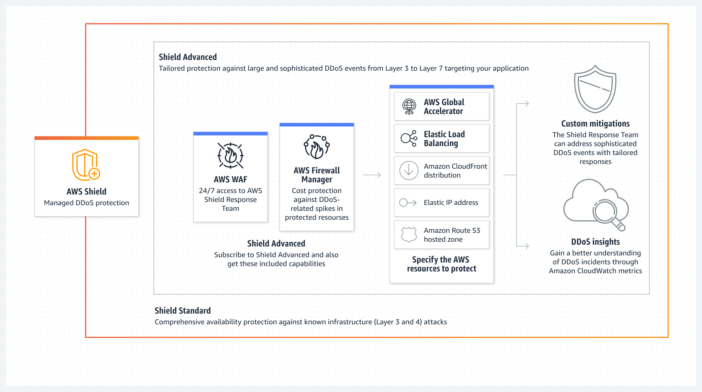

# AWS Cloud Practitioner Foundational 2023

Este repositório foi criado com o intuito de realizar minhas anotações durante meus estudos para a certificação <a href="https://aws.amazon.com/pt/certification/certified-cloud-practitioner/">AWS Certified Cloud Practitioner</a> e compartilhá-las com quem precise.

* [Tópicos](#topicos)
    - [Pesos](#Pesos)
    - [Conceitos de nuvem](#nuvem)
    - [Segurança e conformidade](#seguranca)
    - [Tecnologia](#tecnologia)
    - [Faturamento e preços](#faturamento)

## Pesos
Domínio | % do exame
---------|----------|
Domínio 1: Conceitos de nuvem | 26%  
Domínio 2: Segurança e conformidade | 25%  
Domínio 3: Tecnologia | 33%  
Domínio 4: Faturamento e preços  | 16%  
TOTAL | 100%

**[REFERÊNCIA](https://d1.awsstatic.com/pt_BR/training-and-certification/docs-cloud-practitioner/AWS-Certified-Cloud-Practitioner_Exam-Guide.pdf)** 

## Conceitos de nuvem

### 1. O que é Cloud Computing?
Define-se na utilização de recurso de TI sob demanda por meio da internet, permitindo escabilidade, e sua cobrança é realizada de acordo com o uso.

**[REFERÊNCIA](https://aws.amazon.com/pt/what-is-cloud-computing/)**

### 2. Vantagens em se utilizar Cloud Computing
* **Agilidade:** maior agilidade no processo de desenvolvimento e implatanção de soluções.
* **Elasticidade:** permite provisionar mais recurso às soluções de acordo com a demanda, aumentando e diminuindo seus recursos de forma automática, sem interrupção do serviço.
* **Economia de custo:** o custo é mais baixo devido a cobrança ser realizada de acordo com a utilização dos recursos, além de possibilitar a contratação de planos de economia, diminuindo ainda mais seu preço.
* **Implantação global em questão de minutos:** a nuvem possibilita ampliar seus atividades em várias regiões geográficas e implantação em minutos.

**[REFERÊNCIA](https://docs.aws.amazon.com/pt_br/whitepapers/latest/aws-overview/six-advantages-of-cloud-computing.html)**

### 3. Tipos de Cloud Computing
* **IaaS (Infrastructure as a Service):** oferece o mais alto nível de flexibilidade e controle de gerenciamento sobre recursos, contendo os componente básicos de TI em nuvem. Exemplo AWS EC2.
* **PaaS (Plataform as a Service):** não é necessário o gerenciamento de infraestutura (hardware e sistemas operacionais), focando na implantação e gerenciamento das aplicações. Exemplo AWS Lambda.
* **SaaS (Software as a Service):** oferece um produto completo, executado e gerenciado pelo provedor de serviços. Refere-se às aplicações de usuário final. Exemplo Amazon RDS.

  

**[REFERÊNCIA](https://aws.amazon.com/pt/types-of-cloud-computing/)**

### 4. Modelos de Cloud Computing
* **Public:** modelo mais comum e utilizado, nesse tipo de contrato, o provedor tem servidores próprios onde aloca dados, softwares e sistemas de seus clientes de forma independente e isolada.
* **Private:** bem parecida com o modelo público, com a diferença que a infraestrutura contratada não é compartilhada com outros clientes.
* **Hybrid:** permite a mesclagem da praticidade da nuvem pública com a personalização e contenção da nuvem privada.

## Segurança e conformidade

### 1. Modelo de responsabilidade
Constitue em uma responsabilidade compartilhada entre a AWS e o cliente. A AWS opera, gerencia e controla os componentes do sistema operacional do host e a camada de virtualização, até a segurança física das instalações em que o serviço opera. O cliente assume a gestão e a responsabilidade pelo sistema operacional convidado (inclusive atualizações e patches de segurança), por outros softwares de aplicativos associados e pela configuração do firewall do grupo de segurança fornecido pela AWS.
* **Responsabilidade da AWS:** segurança da nuvem: a AWS é responsável por proteger a infraestrutura que executa todos os serviços oferecidos na sua nuvem.
* **Responsabilidade do cliente:** segurança na nuvem: a responsabilidade do cliente será determinada pelos Serviços de nuvem AWS selecionados por ele.

  

**[REFERÊNCIA](https://aws.amazon.com/pt/compliance/shared-responsibility-model/)**

### 2. AWS Artifact
Portal de autoatendimento para recuperação de artefatos de auditoria que oferece aos clientes acesso sob demanda à documentação de conformidade e aos acordos da AWS.

**[REFERÊNCIA](https://aws.amazon.com/pt/artifact/)**

### 3. WAF vs. Shield
* **WAF:** ajuda você a se proteger contra explorações comuns da Web e bots que podem afetar a disponibilidade, comprometer a segurança ou consumir recursos excessivos.

  

* **Shield:** serviço gerenciado de proteção contra DDoS que protege as aplicações em execução na AWS.

  

### 4. AWS Inpsector, Trusted Advisor e CloudTrail
* **AWS Inpsector:** serviço de gerenciamento de vulnerabilidades que verifica continuamente AWS workloads em busca de vulnerabilidades de software e exposição não intencional da rede. Descobre e escaneia automaticamente instâncias do Amazon EC2 em execução, imagens de contêineres no Amazon Elastic Container Registry (Amazon ECR) e AWS Lambda funções em busca de vulnerabilidades de software conhecidas e exposição não intencional à rede.
* **Trusted Advisor:** faz recomendações que ajudam a seguir as práticas recomendadas da AWS. Avalia a conta por meio de verificações, indentificando formas de otimizar a infraestrutura da AWS, aumentar a segurança e a performance, reduzir os custos gerais e monitorar as cotas de serviço. Depois, pode seguir as recomendações da verificação para otimizar o recursos e serviços.
* **CloudTrail:** monitora e registra a atividade da conta por toda a infraestrutura da AWS, oferecendo controle sobre o armazenamento, análise e ações de remediação.

### 5. Athena vs. Macie
* **Athena:** serviço de consultas interativas que facilita a análise de dados no Amazon S3 usando SQL padrão. O Athena não usa servidor, de forma que não existe uma infraestrutura para configurar ou gerenciar, é possível começar a analisar os dados imediatamente. Não é necessário nem mesmo carregar dados no Athena, ele trabalha diretamente com os dados armazenados no S3.
* **Macie:** serviço de segurança e privacidade de dados totalmente gerenciado que usa machine learning e correspondência de padrões para descobrir e proteger seus dados confidenciais na AWS.

### 6. IAM
Com o *Identity and Access Management* (IAM) é possível especificar quem ou o que pode acessar serviços e recursos na AWS, gerenciar permissões de maneira centralizada e analisar o acesso para conceder as permissões na AWS.

  

### 6.1 Usuários, grupos, funções e políticas
* **Usuários:** qualquer credencial, ou identidade do IAM, que possua acessar a AWS via console, CLI ou API. Após criado, o usuário somente tem permissão de fazer login na plataforma devido o princípio do menor privilégio (*least privilege principle*) e recomenda-se sempre utiliza-lo. Por questões de segurança, não é recomendado a utilização do usuário root da conta.
* **Grupos:** coleção de usuários do IAM. Facilitam o gerenciamento de permissões para grandes conjuntos de usuários.
* **Funções:** identidade do IAM que permite que uma conta tenha permissões específicas, podendo ser aplicadas a serviços da AWS.
* **Políticas:** regras que concedem ou bloqueiam acesso de usuários ou grupos aos serviços da AWS.

### 6.2 MFA
Recomenda-se a configuração da autenticação multifator (MFA) para ajudar a proteger os recursos da AWS. É pssível habilitar a MFA para o Usuário raiz da conta da AWS ou para usuários do IAM.

### 6.3 Política de senha no IAM
Recomenda-se definir uma política de senha personalizada às contas da AWS para especificar requisitos de complexidade e períodos de alternância obrigatórios para as senhas de usuários do IAM.

**[REFERÊNCIA](https://docs.aws.amazon.com/pt_br/IAM/latest/UserGuide/introduction.html/)**

## Tecnologia

### 1. AWS CLI e CloudShell
* **AWS CLI:** ferramenta unificada para o gerenciamento de seus produtos da AWS, instalada localmente nas estações de trabalho.
* **CloudShell:** shell pré-autenticado baseado em navegador onde é possível iniciar diretamente do AWS Management Console.

**[REFERÊNCIA](https://docs.aws.amazon.com/pt_br/cloud9/latest/user-guide/sample-aws-cli.html)**

### 2. Infraestrutura global da AWS
A Nuvem AWS abrange 99 zonas de disponibilidade em 31 regiões geográficas por todo o mundo, com planos já divulgados para mais 15 zonas de disponibilidade e outras 5 regiões da AWS no Canadá, Israel, Malásia, Nova Zelândia e Tailândia. 

  

### 2.1. Regiões da AWS
Local físico em todo o mundo onde datacenters são agrupados. Cada grupo de datacenters lógicos é chamado de zona de disponibilidade. Cada região da AWS consiste no mínimo em três AZs isoladas e separadas fisicamente em uma área geográfica.

### 2.2. Zonas de disponibilidade (AZ)
Consistem em um ou mais datacenters distintos com energia, rede e conectividade redundantes em uma região da AWS. As AZs proporcionam aos clientes a capacidade de operar suas aplicações com alta disponibilidade, tolerância a falhas e escalabilidade em níveis superiores aos que um único datacenter pode oferecer. As AZs são fisicamente separadas por uma distância significativa (vários quilômetros) das outras AZs, embora todas estejam em um raio de até 100 km entre si.

### 2.3. Zonas locais
Aproximam a computação, o armazenamento, o banco de dados e outros produtos da AWS selecionados dos usuários finais. Com isso é possível executar facilmente aplicativos altamente exigentes que exigem latências em milissegundos para seus usuários finais, como criação de conteúdo de mídia e entretenimento, jogos em tempo real, simulações de reservatórios, automação de projetos eletrônicos e machine learning.

### 2.4. AWS Wavelength
Implantações de infraestrutura da AWS que incorporam serviços de computação e armazenamento da AWS aos datacenters dos provedores de telecomunicações na borda das redes 5G e acessam facilmente a variedade de serviços da AWS na região.

**[REFERÊNCIA](https://aws.amazon.com/pt/about-aws/global-infrastructure/)**

### 2.5. AWS Outspots
Solução totalmente gerenciadas que fornece infraestrutura e serviços da AWS para praticamente qualquer local da borda ou on-premises para uma experiência híbrida verdadeiramente consistente. As soluções do Outposts permitem que os clientes estendam e executem serviços da AWS nativos on-premises.

**[REFERÊNCIA](https://aws.amazon.com/pt/outposts/)**

### 3. Plano de suporte
* **Basic:** plano Básico é gratuito e oferece suporte para dúvidas sobre contas e faturamento e aumentos de cotas de serviços.
* **Developer:** plano Desenvolvedor concede orientação sobre as melhores práticas, ferramentas de diagnóstico, suporte de arquitetura básica e número ilimitado de casos de suporte.
* **Business:** plano Business concede orientação de casos de uso, AWS Trusted Advisor, suporte a software de terceiros e número ilimitado de usuários do AWS Identity and Access Management (IAM).
* **Enterprise:** plano Enterprise concede orientação sobre arquitetura de aplicação, gerenciamento de eventos de infraestrutura, gerente de conta técnico, roteamento de casos "white-glove" e análises empresariais de gerenciamento.

**[REFERÊNCIA](https://docs.aws.amazon.com/pt_br/awssupport/latest/user/aws-support-plans.html)**

### 4. EC2
Elastic Compute Cloud é um serviço que oferece uma capacidade de computação escalável na AWS. Elimina a necessidade de investir em hardware inicialmente, portanto, permitindo ao desenvolver implantar aplicativos com mais rapidez.

### 4.1 Tipos de instâncias EC2
* **Uso geral:** ideais para aplicativos que usam  recursos de computação, memória e rede em proporções iguais, como servidores web e repositórios de código.
* **Otimizadas para computação:** ideais para aplicativos vinculados a computação que se beneficiam de processadores de alta performance.
* **Otimizada para memória:** fornece performance rápida para workloads que processam grandes conjuntos de dados na memória.
* **Otimizada para armazenamento:** projetadas para cargas de trabalho que exigem acesso de leitura e gravação sequencial alto a conjuntos de dados muito grandes no armazenamento local.
* **Computação acelerada:** usam aceleradores de hardware, ou coprocessadores, para executar funções, como cálculos de número de ponto flutuante, processamento de gráficos ou correspondência de padrões de dados, mais eficientemente do que é possível no software em execução nas CPUs.

**[REFERÊNCIA](https://docs.aws.amazon.com/pt_br/AWSEC2/latest/UserGuide/concepts.html)**

### 4.2 Auto Scaling
Ajuda a garantir que tenha o número correto de instâncias do Amazon EC2 disponíveis para processar a carga da aplicação. A  criação de coleções de instâncias EC2 é chamada de grupos de Auto Scaling. É possível especificar o número mínimo de instâncias em cada grupo do Auto Scaling, e o Amazon EC2 Auto Scaling garante que o grupo nunca seja menor que esse tamanho. É possível especificar o número máximo de instâncias em cada grupo do Auto Scaling, e o Amazon EC2 Auto Scaling garante que o grupo nunca seja maior que esse tamanho.
* **Scaling UP:** Escalonamento vertical
* **Scaling OUT:** Escalonamento horizontal (Auto Scaling)

### 4.3 Políticas de escabilidade
* **Step/Simple Scaling:** escolhe as métricas de escalabilidade e os valores de limite para os CloudWatch alarmes que invocam o processo de escalabilidade. Também define como o grupo do Auto Scaling deve ser escalado quando um limite for violado para um número especificado de períodos de avaliação.
* **Target Tracking:** especifica uma métrica CloudWatch e um valor de objetivo que representa a utilização média ideal ou o nível de throughput da aplicação. Em seguida, o Amazon EC2 Auto Scaling poderá aumentar a escala na horizontal do grupo (adicionar mais instâncias) para processar picos de tráfego, e reduzir a escala na horizontal do grupo (executar menos instâncias) para reduzir custos durante períodos de baixa utilização ou throughput.

**[REFERÊNCIA](https://docs.aws.amazon.com/pt_br/autoscaling/ec2/userguide/what-is-amazon-ec2-auto-scaling.html)**

### 4.4 Elastic Load Balancer
O Elastic Load Balancing (ELB) distribui automaticamente o tráfego de aplicações de entrada entre vários destinos e dispositivos virtuais em uma ou mais Zonas de disponibilidade (AZs). É compatível com os seguintes tipos de balanceadores de carga: Application Load Balancers e Network Load Balancers. Os serviços do Amazon ECS podem usar esses tipos de balanceador de carga. Os application load balancers são usados para encaminhar o tráfego HTTP/HTTPS (ou Camada 7). Os network load balancers e os classic load balancers são usados para encaminhar o tráfego TCP (ou da Camada 4).
* **Application Load Balancer (ALB):** toma decisões de roteamento na camada da aplicação (HTTP/HTTPS), oferece suporte ao roteamento com base em caminho e pode encaminhar solicitações para uma ou mais portas em cada instância de contêiner no cluster. Os application load balancers oferecem suporte ao mapeamento de porta de host dinâmico.
* **Network Load Balancer (NLB):** toma decisões de roteamento na camada de transporte (TCP/SSL). Ele pode processar milhões de solicitações por segundo. Após o load balancer receber uma conexão, ele seleciona um destino do grupo de destino para a regra padrão usando um algoritmo de roteamento de hash de fluxo.

**[REFERÊNCIA](https://docs.aws.amazon.com/pt_br/AmazonECS/latest/developerguide/load-balancer-types.html)**

### 5. S3
Amazon Simple Storage Service é um serviço de armazenamento de objetos que oferece escalabilidade, disponibilidade de dados, segurança e performance líderes do setor.
* Armazenamento ilimitado
* Baixa latência e alta velocidade
* Compartilhamento de arquivos ou criação de website estático
* Disponibilidade de 99.95%
* Durabilidade de 99.999999999%
* Permite versionamento dos objetos
* Tamanho máximo objeto de 5Tb

  

**[REFERÊNCIA](https://docs.aws.amazon.com/pt_br/AmazonS3/latest/userguide/Welcome.html)**

### 5.1 Classes de armazenamento
* **S3 Standard:** esse tipo de armazenamento oferece objetos que possuem um nível resiliência muito alta, permitindo uma disponibilidade e performance para dados que são acessados com bastante frequência.
* **S3 Intelligent-Tiering:** criado pensando na otimização, ou seja, ela move de forma automática os dados para um nível que seja mais econômico, gerando assim um ótimo corte de gastos. Possui dois níveis: acesso frequente e acesso infrequente.
* **S3 Standard-Infrequent Acess (S3 Standard-IA):** usado em casos onde os dados precisam ser acessados de forma rápida, porém com pouca frequência.
* **S3 One-Zone-Infrequent Acess (S3 One Zone-IA):** mesma característica do S3 Standard-IA, com a diferença que os dados são armazenados em uma única Availability Zone, baixando o custo.
* **S3 Glacier Instant Retrieval:** armazenamento de custo mais baixo para dados de longa duração, que raramente são acessados e exigem recuperação em milissegundos.
* **S3 Glacier Flexible Retrieval:** oferece armazenamento de baixo custo, custo até 10% menor (do que o S3 Glacier Instant Retrieval), para dados de arquivo que são acessados 1 a 2 vezes por ano e recuperados de forma assíncrona.
* **S3 Glacier Deep Archive:** classe de armazenamento mais acessível do Amazon S3 e oferece suporte à retenção e preservação digital de longo prazo para dados que podem ser acessados uma ou duas vezes por ano. Essa classe é projetada para clientes que mantêm conjuntos de dados por 7 a 10 anos ou mais para cumprir requisitos de conformidade regulatória, especialmente em setores altamente regulados como serviços financeiros, saúde e setores públicos.
* **S3 Outposts:** oferece armazenamento de objetos para seu ambiente de AWS Outposts on-premises.

Classes | S3 Standard | S3 Intelligent-Tiering | S3 Standard-IA | S3 One Zone-IA | S3 Glacier Instant Retrieval | S3 Glacier Flexible Retrieval
---------|----------|----------|----------|----------|----------|----------|
Projetado para resiliência | 99,999999999% | 99,999999999% | 99,999999999% | 99,999999999% | 99,999999999% | 99,999999999%
Projetado para disponibilidade |  99,99% | 99,99% | 99,99% | 99,95% | 99,99% | 99,99%
Acordo de nível de serviço de disponibilidade | 99,9% | 99% | 99% | 99% | 99% | 99,9%
Zonas de disponibilidade | ≥3 | ≥3 | ≥3 | 1 | ≥3 | ≥3
Cobrança mínima de capacidade por objeto | N/D | N/D | 128 KB | 128 KB | 128 KB | N/D
Taxa de recuperação | N/D | N/D | por GB recuperado | por GB recuperado | por GB recuperado | por GB recuperado | por GB recuperado
Latência de primeiro byte | milissegundos | milissegundos | milissegundos | milissegundos | milissegundos | minutos ou horas
Tipo de armazenamento | Objeto | Objeto | Objeto | Objeto | Objeto | Objeto
Transições de ciclo de vida | Sim | Sim | Sim | Sim | Sim | Sim

### 6. Serviços de armazenamento
* **AMI:** Amazon Machine Image é uma imagem compatível e mantida pela AWS, que fornece as informações necessárias para iniciar uma instância.
* **EBS:** Amazon Elastic Block Store é um serviço de armazenamento em blocos fácil de usar, escalável e de alta performance projetado para o EC2.
* **EFS:** Amazon Elastic File System aumenta e diminui automaticamente conforme se adiciona e remove arquivos, sem a necessidade de gerenciamento ou provisionamento.
* **CloudFront:** serviço de rede de entrega de conteúdo (CDN) criado para alta performance, segurança e conveniência do desenvolvedor.
* **S3 Glacier:** classe de armazenamento do S3 desenvolvida especificamente para o arquivamento de dados, para oferecer a mais alta performance, a maior flexibilidade de recuperação e o armazenamento de arquivamento de menor custo na nuvem.
* **Snowball:** serviço que fornece dispositivos robustos e seguros para que possa utilizar os recursos de armazenamento e computação da AWS em ambientes de borda e transferir dados de e para a AWS.
* **Storage Gateway:** conjunto de serviços de armazenamento na nuvem híbrida que oferece acesso on-premises a armazenamento virtual na nuvem praticamente ilimitado.
* **Instance Store:** fornece armazenamento temporário em nível de bloco para a instância. Esse armazenamento está localizado em discos que estão anexados fisicamente ao computador host.

### 7. Outros serviços AWS
* **Batch:** permite que desenvolvedores  executem milhares de tarefas de computação em lote e em ML enquanto otimizam recursos computacionais para que possa se concentrar na análise de resultados e na solução de problemas. 
* **Lightsail:** maneira mais fácil de começar a usar a AWS para desenvolvedores, pequenas empresas, estudantes e outros usuários que precisam de uma solução para construir e hospedar suas aplicações na nuvem.
* **Lambda:** serviço de computação sem servidor e orientado a eventos que permite executar código para praticamente qualquer tipo de aplicação ou serviço de backend sem provisionar ou gerenciar servidores.
* **SNS:** Simple Notification Service é um serviço gerenciado que fornece entrega de mensagens de editores para assinantes (também conhecido como *ProdutoreseConsumidores*).
* **SQS:** Amazon Simple Queue Service permite enviar, armazenar e recebar mensagens entre componentes de software em qualquer volume, sem perder mensagens ou precisar que outros serviços estejam disponíveis.
* **ECS:** Amazon Elastic Container Service é um serviço de orquestração de contêineres totalmente gerenciado que simplifica a implantação, o gerenciamento e a escalabilidade de aplicações conteinerizadas.
* **EKS:** Amazon Elastic Kubernetes Service é um serviço gerenciado que pode ser usado para executar o Kubernetes na AWS, sem necessidade de instalar e manter seus próprios nós ou ambiente de gerenciamento do Kubernetes.
* **Route 53:** serviço da Web de Sistema de Nomes de Domínio (DNS) altamente disponível e escalável. O Route 53 conecta as requisições do usuário a aplicações da Internet executadas na AWS ou on-premises.

## Faturamento e preços

### 1. Billing
Serviço que facilita entender os gastos com a AWS, visualizar e pagar faturas, gerenciar preferências de faturamento e configurações de impostos e acessar outros serviços de gerenciamento financeiro na nuvem. Avaliar rapidamente se os gastos mensais estão alinhados a períodos anteriores, previsões ou orçamentos para investigar e executar ações corretivas em tempo hábil. Os fundamentos da precificação da AWS são: computação, armazenamento e *Data Transfer Out*.

**[REFERÊNCIA](https://docs.aws.amazon.com/pt_br/account-billing/index.html)**

### 1.1 Sistema de cobrança da AWS
* **Pay as you go:** pague e use.
* **Pay for what you use:** pague de acordo com o que utilizar.
* **Pay less by using more:** pague menos por quando mais usar.
* **Pay even less:** pague muito menos quando se reservar.

### 1.2 Capex vs. Opex
* **Capex:** ou custos de capital, se trata de investimentos em bens de capital, que são investimentos para obtenção de benefícios no longo prazo.
* **Opex:** ou custo operacional, se trata de inventimentos para se manter a operação, não há grandes despesas iniciais, o que permite maior fluxo de caixa.

### 1.3 Budget e Cost Explorer
* **Budget:** definição de orçamentos personalizados para rastrear custos e o uso e criação de alertas de notificações por email ou SNS se exceder o limite predefinido.
* **Cost Explorer:** interface de fácil utilização que permite visualizar, entender e gerenciar os custos e o uso da AWS ao longo do tempo. Gera relatórios personalizados que analisam dados de custos e uso. Analisa dados de forma resumida (por exemplo, custos e uso totais em todas as contas) ou detalha os dados de custos e uso para identificar tendências, determinar causadores de custos e detectar anomalias.

**[REFERÊNCIA](https://aws.amazon.com/pt/premiumsupport/technology/trusted-advisor/)**

### 2. Organizations
Permite criar novas contas da AWS sem custo adicional. Com contas em uma organização, pode facilmente alocar recursos, agrupar contas e aplicar políticas de governança a contas ou grupos.

  

**[REFERÊNCIA](https://aws.amazon.com/pt/organizations/)**

### 3. Calculator
servSço da Web que pode ser usado para criar estimativas de custos correspondentes ao caso de uso da AWS. O AWS Pricing Calculator é útil para pessoas que nunca usaram a AWS e para quem deseja reorganizar ou expandir seu uso.

**[REFERÊNCIA](https://calculator.aws/)**